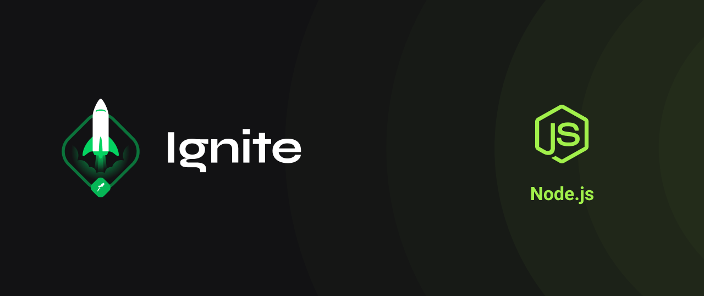

<div align="center" id="top"> 
  

&#xa0;

  <!-- <a href="https://desafio.netlify.com">Demo</a> -->
</div>

<h1 align="center">Desafio</h1>

<p align="center">
  

  

  

  

  <!--  -->

  <!--  -->

  <!--  -->
</p>

<!-- Status -->

<!-- <h4 align="center">
	🚧  Desafio 🚀 Em construção...  🚧
</h4>

<hr> -->

<p align="center">
  <a href="#computer-sobre-o-desafio">Sobre</a> &#xa0; | &#xa0;
  <a href="#rocket-tecnologias">Tecnologias</a> &#xa0; | &#xa0;
  <a href="#white_check_mark-pré-requisitos">Pré requisitos</a> &#xa0; | &#xa0;
  <a href="#checkered_flag-começando">Começando</a> &#xa0; | &#xa0;
  <a href="#memo-licença">Licença</a> &#xa0; | &#xa0;
  <a href="https://github.com/thiilins" target="_blank">Autor</a>
</p>

<br>

## :computer: Sobre o desafio

Nesse desafio você irá trabalhar mais a fundo com middlewares no Express. Dessa forma você será capaz de fixar mais ainda os conhecimentos obtidos até agora.
&#xa0;

### checksExistsUserAccount

Esse middleware é responsável por receber o username do usuário pelo header e validar se existe ou não um usuário com o username passado. Caso exista, o usuário deve ser repassado para o request e a função next deve ser chamada.

&#xa0;

### checksCreateTodosUserAvailability

Esse middleware deve receber o **usuário** já dentro do request e chamar a função next apenas se esse usuário ainda estiver no **plano grátis e ainda não possuir 10 _todos_ cadastrados** ou se ele **já estiver com o plano Pro ativado**.

&#xa0;

### checksTodoExists

Esse middleware deve receber o **username** de dentro do header e o **id** de um _todo_ de dentro de `request.params`. Você deve validar o usuário, validar que o `id` seja um uuid e também validar que esse `id` pertence a um _todo_ do usuário informado.

Com todas as validações passando, o _todo_ encontrado deve ser passado para o `request` assim como o usuário encontrado também e a função next deve ser chamada.

&#xa0;

### findUserById

Esse middleware possui um funcionamento semelhante ao middleware `checksExistsUserAccount` mas a busca pelo usuário deve ser feita através do **id** de um usuário passado por parâmetro na rota. Caso o usuário tenha sido encontrado, o mesmo deve ser repassado para dentro do `request.user` e a função next deve ser chamada.

&#xa0;

## :rocket: Tecnologias

As seguintes ferramentas foram usadas na construção do projeto:

- [Node.js](https://nodejs.org/en/)
  &#xa0;

## :white_check_mark: Pré requisitos

Antes de começar :checkered_flag:, você precisa ter o [Git](https://git-scm.com) e o [Node](https://nodejs.org/en/) instalados em sua maquina.

## :checkered_flag: Começando

```bash
# Clone este repositório
$ git clone https://github.com/thiilins/ignite-trabalhando-com-middlewares

# Entre na pasta
$ cd desafio

# Instale as dependências
$ yarn

# Para iniciar o projeto
$ yarn dev

# O app vai inicializar em <http://localhost:3000>
```

## :memo: Licença

Este projeto está sob licença MIT. Veja o arquivo [LICENSE](LICENSE.md) para mais detalhes.

Feito com :heart: por <a href="https://github.com/thiilins" target="_blank">Thiago Lins</a>

&#xa0;

 <p align="right">(<a href="#top">Voltar para o topo</a>)</p>
